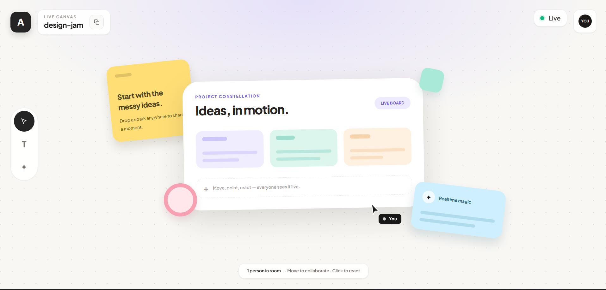

# Live Canvas - Multiplayer Sync Engine

A high-performance, real-time multiplayer collaborative canvas built with React, Node.js, and raw WebSockets. This project focuses on delivering a buttery-smooth, Figma-like visual experience powered by a strictly validated, scalable backend architecture.

**Author:** ADITYA SING (ID: 23U03031)  
*Engineered for scalable backend systems.*
## 🚀 Key Features

*   **Fluid Cursor Interpolation:** Implements a 100ms time-machine buffer utilizing Linear Interpolation (Lerp) to absorb network jitter and ensure flawless remote cursor movement.
*   **Strict Protocol Validation:** Uses raw WebSockets rather than third-party libraries (like Socket.IO). All payloads are validated at runtime against strict TypeScript schemas.
*   **Intelligent Throttling:** Client `mousemove` events are actively throttled to ~25Hz to prevent network saturation while maintaining high visual fidelity.
*   **Functional Tool Palette:** A state-driven UI allowing users to switch between standard Pointers, Sticky Notes (Text), and Spark Reactions.
*   **Room-Based Isolation:** Backend handles isolated concurrent sessions using nested hash maps (`Map<RoomId, Map<ClientId, WebSocket>>`), complete with asymmetric broadcasting and aggressive disconnect cleanup.
*   **Modern Workspace UI:** Proportional 125% scaled interface using Tailwind CSS and Plus Jakarta Sans, featuring dynamic shareable URLs for instant collaboration.

## 🛠 Tech Stack

*   **Frontend:** React (Vite), TypeScript, Tailwind CSS
*   **Backend:** Node.js, raw `ws` package, TypeScript
*   **Protocol:** Shared TypeScript interfaces with explicit runtime type guards

## 📦 Getting Started

### 1. Start the Relay Server
The Node.js server handles WebSocket connections, room routing, and payload validation.

```bash
cd server
npm install
npm run dev
```
## 🌐 Usage

1. Open `http://localhost:5173` in your browser.
2. The app will automatically join the default `design-jam` room.
3. Click the **Copy Link** icon in the top-left header to share the exact room URL with peers.
4. To create a new private workspace, simply change the URL parameter: `http://localhost:5173/?room=my-custom-room`.
5. Use the sidebar to switch tools. Select the **Spark (✦)** tool and click the canvas to broadcast reactions to everyone in the room.

## 📖 Architecture & Design Decisions

For a deep dive into the network throttling limits, the math behind the time-machine buffer, and the strict server memory management, please read the [ARCHITECTURE.md](./ARCHITECTURE.md) file.

---
